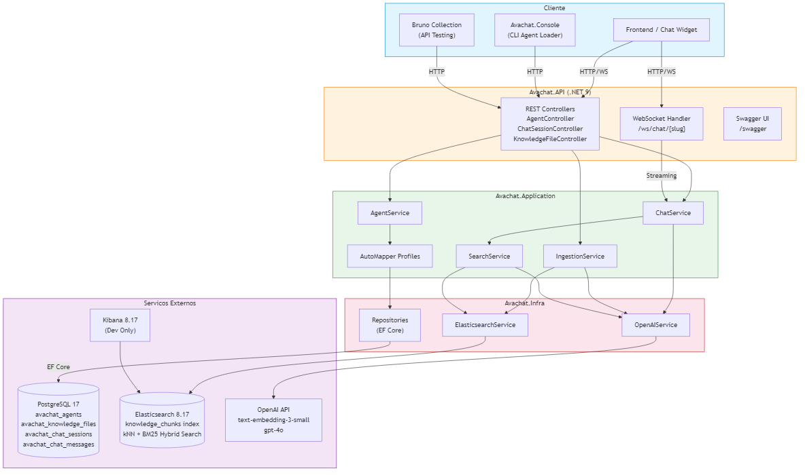

# AvaBot - Knowledge Agent Chatbot Platform


## Overview

**Avachat** is a platform for creating AI-powered chatbot agents with custom knowledge bases. Each agent has its own personality (system prompt), knowledge documents, and can engage in real-time conversations via WebSocket using RAG (Retrieval-Augmented Generation) with lexical (BM25) search in Elasticsearch.

Built with **ASP.NET Core 9**, **Entity Framework Core**, **Elasticsearch** for vector/text search, and **OpenAI** for embeddings and chat completion. Follows **Clean Architecture** with separated Domain, Application, Infrastructure, and API layers.

---

## 🗂️ Monorepo Structure

This repository now unifies both the backend (.NET, at the repo root) and the frontend (React/Vite, under [`frontend/`](frontend/README.md)). See [`frontend/README.md`](frontend/README.md) for frontend-specific setup, scripts, and architecture. Shared feature specs for both live under [`specs/`](specs/).

---

## 🚀 Features

- 🤖 **Multi-Agent Support** - Create unlimited agents with custom system prompts and knowledge bases
- 📚 **RAG Pipeline** - Upload `.md` documents, auto-chunked and indexed with embeddings for retrieval
- 🔍 **Text Search** - BM25 keyword search via Elasticsearch, with no embedding call at query time
- 💬 **Real-Time Chat** - WebSocket streaming with token-by-token response delivery
- 🔄 **Auto Slug Generation** - Agent slugs generated from name with accent handling and uniqueness
- 📋 **Session Management** - REST endpoint to start sessions with user data collection
- 🛠️ **CLI Agent Loader** - Console app to create/sync agents from local files
- 📊 **Chat History** - Paginated sessions and messages with user context in AI prompts
- 🐳 **Docker Ready** - Development and production compose files with health checks

---

## 🛠️ Technologies Used

### Core Framework
- **ASP.NET Core 9.0** - Web API with Controllers and WebSocket middleware
- **Entity Framework Core 9.x** - ORM with Npgsql provider for PostgreSQL

### Database & Search
- **PostgreSQL 17** - Primary relational database
- **Elasticsearch 8.17** - Vector and full-text search engine for knowledge chunks

### AI
- **OpenAI API** - `text-embedding-3-small` for embeddings, `gpt-4o` for chat completion

### Libraries
- **AutoMapper 16.x** - Object mapping between layers
- **FluentValidation** - Request validation
- **MediatR** - Mediator pattern
- **Flurl.Http** - HTTP client for Console app and integration tests
- **Swashbuckle** - Swagger/OpenAPI documentation

### Testing
- **xUnit** - Test framework
- **Moq** - Mocking library
- **FluentAssertions** - Fluent assertion library

---

## 📁 Project Structure

```
Avachat/
├── AvaBot.API/                 # REST API + WebSocket handler
│   ├── Controllers/             # AgentController, ChatSessionController, KnowledgeFileController
│   ├── Validators/              # FluentValidation validators
│   └── WebSocket/               # ChatWebSocketHandler
├── AvaBot.Application/         # Business logic layer
│   ├── Profiles/                # AutoMapper profiles
│   └── Services/                # AgentService, ChatService, IngestionService, SearchService
├── AvaBot.Domain/              # Domain models and enums
│   ├── Models/                  # Agent, ChatSession, ChatMessage, KnowledgeFile
│   └── Enums/                   # ProcessingStatus, SenderType
├── AvaBot.DTO/                 # Data Transfer Objects
├── AvaBot.Infra/               # Infrastructure implementation
│   ├── AppServices/             # ElasticsearchService, OpenAIService
│   ├── Context/                 # AvaBotContext (EF Core DbContext)
│   └── Repository/              # Generic repository implementations
├── AvaBot.Infra.Interfaces/    # Generic repository and service interfaces
├── AvaBot.Console/             # CLI for creating/syncing agents from files
├── AvaBot.Tests/               # Unit tests (xUnit + Moq)
├── AvaBot.Tests.API/           # Integration tests (Flurl + FluentAssertions + WebSocket)
├── agent_input/                 # Agent configuration input directory
│   ├── system_prompt.md         # Agent system prompt
│   ├── description.md           # Agent description
│   └── docs/                    # Knowledge base documents (.md)
├── bruno/                       # Bruno API collection
├── docker-compose.yml           # Development environment
├── docker-compose-prod.yml      # Production environment
├── Dockerfile                   # Multi-stage .NET build
├── avabot.sql                  # Database schema
├── frontend/                    # React/Vite frontend (see frontend/README.md)
└── .github/workflows/           # CI/CD pipelines
```

---

## 🏗️ System Design



The platform follows a layered architecture where the API layer handles HTTP/WebSocket requests, delegates to Application services for business logic, which in turn use Infrastructure services for data access, search, and AI integration.

**RAG Flow:** User message → Generate embedding (OpenAI) → Hybrid search in Elasticsearch → Build prompt with context → Stream response from GPT-4o → Save to database.

> 📄 **Source:** The editable Mermaid source is available at [`docs/system-design.mmd`](docs/system-design.mmd).

---

## ⚙️ Environment Configuration

### 1. Copy the environment template

```bash
cp .env.example .env
```

### 2. Edit the `.env` file

```bash
# Database
POSTGRES_USER=postgres
POSTGRES_PASSWORD=your_password_here
POSTGRES_DB=avabot
CONNECTION_STRING=Host=db;Database=avabot;Username=postgres;Password=your_password_here

# Elasticsearch
ELASTICSEARCH_URL=http://elasticsearch:9200

# App
APP_PORT=5000
```

⚠️ **IMPORTANT**:
- Never commit the `.env` file with real credentials
- Only `.env.example` and `.env.prod.example` are version controlled
- Each agent carries its own OpenAI API key, configured in the admin panel and stored
  encrypted in the database (`POWERBI_SECRET_ENCRYPTION_KEY` is the key that protects it).
  There is no global `OPENAI_API_KEY` anymore, and no fallback: an agent without its own
  key cannot use chat, semantic search or file ingestion.

### 3. Accounts and authentication

The admin panel uses **user accounts stored in the database** (`avabot_users`). Anyone can
create an account at `/register` (name, e-mail, password with at least 8 characters) and is
logged in right away; there is no e-mail confirmation and no password recovery in this version
(the login page tells users to contact support). Every agent belongs to exactly one account:
the panel only lists and edits the agents of the logged-in user, and any attempt to reach
another user's agent answers `404 "Agente nao encontrado"`, exactly like a non-existent one.
Public channels (chat page, widget, Telegram and WhatsApp webhooks) keep working without login.

Login issues a JWT (HS256, `AVABOT_JWT_SECRET`) valid for **30 days**
(`Auth__TokenExpirationMinutes`, default `43200`). After five failed logins for the same e-mail,
new attempts are refused for 15 minutes.

**First deploy of this version (migration of the current admin login):**

1. Apply the schema migration (creates `avabot_users` and `avabot_agents.owner_user_id`):
   ```bash
   dotnet ef database update --project AvaBot.Infra --startup-project AvaBot.API
   ```
2. Keep `AVABOT_USERNAME` / `AVABOT_PASSWORD` in `.env` for this first start. On startup the API
   creates the admin account from them (the username becomes the login e-mail, lower-cased) and
   assigns every existing agent to it. The log shows
   `Conta do administrador criada (email=...) e N agente(s) atribuído(s)`.
3. If there are agents without an owner and no credentials configured, **the API refuses to
   start** and logs: `Existem N agente(s) sem dono e nao ha Auth:Username/Auth:Password configurados...`
4. After that first start the variables are no longer used for login (accounts live in the
   database) and can be removed from `.env`.

**API contract change:** `POST /auth/login` now takes `{ "email", "password" }` and answers the
standard envelope `{ "sucesso", "mensagem", "dados": { "token", "expiresAt", "user" } }` instead
of `{ "sucesso", "token" }`. The frontend, `AvaBot.Tests.API` and the Bruno collection were updated.

---

## 🐳 Docker Setup

### Quick Start

```bash
# 1. Configure environment
cp .env.example .env
# Edit .env with your OpenAI API key

# 2. Build and start
docker compose up -d --build

# 3. Verify
docker compose ps
```

### Accessing Services

| Service | URL |
|---------|-----|
| **API** | http://localhost:5000 |
| **Swagger** | http://localhost:5000/swagger |
| **WebSocket Chat** | ws://localhost:5000/ws/chat/{slug} |
| **Elasticsearch** | http://localhost:9200 |
| **Kibana** | http://localhost:5601 |
| **PostgreSQL** | localhost:5432 |

### Docker Commands

| Action | Command |
|--------|---------|
| Start services | `docker compose up -d` |
| Start with rebuild | `docker compose up -d --build` |
| Stop services | `docker compose stop` |
| View logs | `docker compose logs -f api` |
| Remove all | `docker compose down` |
| Remove with data (⚠️) | `docker compose down -v` |

---

## 🔧 Manual Setup (Without Docker)

### Prerequisites

- .NET 9.0 SDK
- PostgreSQL 17
- Elasticsearch 8.17
- OpenAI API key

### Setup Steps

#### 1. Create the database

```bash
psql -U postgres -c "CREATE DATABASE avabot;"
psql -U postgres -d avabot -f avabot.sql
```

#### 2. Configure appsettings

Edit `AvaBot.API/appsettings.Development.json` with your local connection strings and OpenAI key.

#### 3. Run the API

```bash
dotnet run --project AvaBot.API
```

The API will be available at `http://localhost:5030`.

---

## 🧪 Testing

### Unit Tests

```bash
dotnet test AvaBot.Tests
```

### Integration Tests (requires API running)

Copy `AvaBot.Tests.API/appsettings.Example.json` to `appsettings.json` (git-ignored) and fill
`ApiSettings.Email` / `Password` with an account of the panel.

```bash
# Terminal 1: start the API
docker compose up -d

# Terminal 2: run integration tests
dotnet test AvaBot.Tests.API
```

### Question Calibration Report (console)

`AvaBot.Calibration` runs a question (or a set of conversations) straight against OpenAI and Power BI — no API, database or Elasticsearch; the knowledge base is read from a local folder — and prints a markdown report with the full flow: knowledge base, Power BI schema, every model round with the DAX and its result, tokens, final prompt and answer, for an AI to analyze. Configure `AvaBot.Calibration/appsettings.json` (git-ignored; copy from `appsettings.Example.json`). See [docs/CALIBRATION.md](docs/CALIBRATION.md).

```powershell
dotnet run --project AvaBot.Calibration -- -q "Qual foi o volume de exportação da tilápia em 2024?"
```

### Test Structure

```
AvaBot.Tests/                    # 71 unit tests
├── Application/Services/         # AgentService, ChatService, IngestionService, SearchService
└── API/
    ├── Controllers/              # AgentController, ChatSessionController, KnowledgeFileController
    └── Validators/               # AgentInsertInfoValidator

AvaBot.Tests.API/                # Integration tests (HTTP + WebSocket)
└── Controllers/                  # Agent, ChatSession, KnowledgeFile, ChatWebSocket
```

---

## 📚 API Documentation

### Endpoints

| Method | Endpoint | Description |
|--------|----------|-------------|
| POST | `/api/auth/register` | Create an account and get a token (public) |
| POST | `/api/auth/login` | Login with e-mail and password (public) |
| GET | `/api/auth/me` | Current account |
| PUT | `/api/auth/me` | Change the account name |
| PUT | `/api/auth/me/password` | Change the password (requires the current one) |
| GET | `/api/agents` | List the agents of the logged-in user |
| GET | `/api/agents/{slug}` | Get agent by slug |
| GET | `/api/agents/{slug}/chat-config` | Get chat configuration |
| POST | `/api/agents` | Create agent (slug auto-generated) |
| PUT | `/api/agents/{id}` | Update agent |
| DELETE | `/api/agents/{id}` | Delete agent |
| PATCH | `/api/agents/{id}/status` | Toggle agent status |
| POST | `/api/agents/{slug}/sessions` | Start chat session |
| GET | `/api/agents/{agentId}/sessions` | List sessions (paginated) |
| GET | `/api/sessions/{sessionId}/messages` | List messages (paginated) |
| GET | `/api/agents/{agentId}/files` | List knowledge files |
| POST | `/api/agents/{agentId}/files` | Upload `.md` file (multipart, max 10MB) |
| DELETE | `/api/agents/{agentId}/files/{fileId}` | Delete knowledge file |
| POST | `/api/agents/{agentId}/files/{fileId}/reprocess` | Reprocess file |
| WS | `/ws/chat/{slug}?sessionId={id}` | WebSocket chat connection |

### WebSocket Protocol

```
1. Connect: ws://localhost:5000/ws/chat/{slug}?sessionId={id}
2. Receive: {"type":"ready"}
3. Send:    {"type":"message","content":"Hello"}
4. Receive: {"type":"chunk","content":"H"}
            {"type":"chunk","content":"ello"}
            {"type":"done"}
```

### Bruno Collection

Import the collection from `bruno/AvaBot API/` in [Bruno](https://www.usebruno.com/) for interactive API testing. Fill the `email` and `password` variables in `collection.bru` (never commit real values); `Auth/Login` stores the token in the `token` variable for the other requests.

---

## 🤖 CLI Agent Loader

Create and sync agents from local files:

```bash
# Structure
agent_input/
├── system_prompt.md    # Agent personality (required)
├── description.md      # Agent description (optional)
└── docs/               # Knowledge base (.md files)
    ├── doc1.md
    └── doc2.md

# Run (from project root)
dotnet run --project AvaBot.Console -- "Agent Name"
```

The CLI will:
- Create the agent if it doesn't exist, or update it if it does
- Sync all `.md` files from `docs/` (upload new, replace changed, remove orphans)

---

## 🚀 Deployment

### Production

```bash
# 1. Configure production secrets
cp .env.prod.example .env.prod

# 2. Create external network
docker network create avabot-external

# 3. Deploy
docker compose --env-file .env.prod -f docker-compose-prod.yml up -d --build
```

### GitHub Actions

Production deploy via SSH is configured in `.github/workflows/deploy-prod.yml` (manual trigger via `workflow_dispatch`).

**Required GitHub Secrets:** `PROD_SSH_HOST`, `PROD_SSH_USER`, `PROD_SSH_PASSWORD`, `POSTGRES_USER`, `POSTGRES_PASSWORD`, `POSTGRES_DB`, `CONNECTION_STRING`, `ELASTICSEARCH_URL`, `POWERBI_SECRET_ENCRYPTION_KEY`

`POWERBI_SECRET_ENCRYPTION_KEY` is required: it is the AES-256 key that protects each
agent's stored credentials (OpenAI API key and Power BI client secret). Use a fresh
32-byte base64 value (`openssl rand -base64 32`), different from the one used in
development — rotating it afterwards makes every already-saved credential unreadable.

---

## 💾 Database

### Schema

The database uses `avabot_` prefix on all tables:

| Table | Description |
|-------|-------------|
| `avabot_agents` | Agent configurations |
| `avabot_knowledge_files` | Uploaded knowledge documents |
| `avabot_chat_sessions` | Chat sessions with user data |
| `avabot_chat_messages` | Individual chat messages |

### Initialize

```bash
psql -U postgres -d avabot -f avabot.sql
```

### Backup

```bash
docker compose exec postgres pg_dump -U postgres avabot > backup.sql
```

### Restore

```bash
docker compose exec -T postgres psql -U postgres avabot < backup.sql
```

---

## 👨‍💻 Author

Developed by **[Rodrigo Landim](https://github.com/emaginebr)**

---

## 📄 License

This project is licensed under the **MIT License** - see the [LICENSE](LICENSE) file for details.

---

**⭐ If you find this project useful, please consider giving it a star!**
